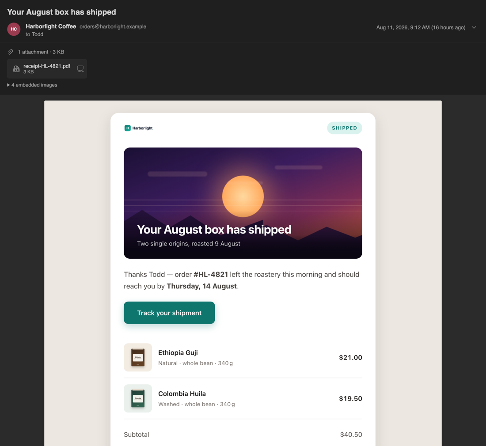
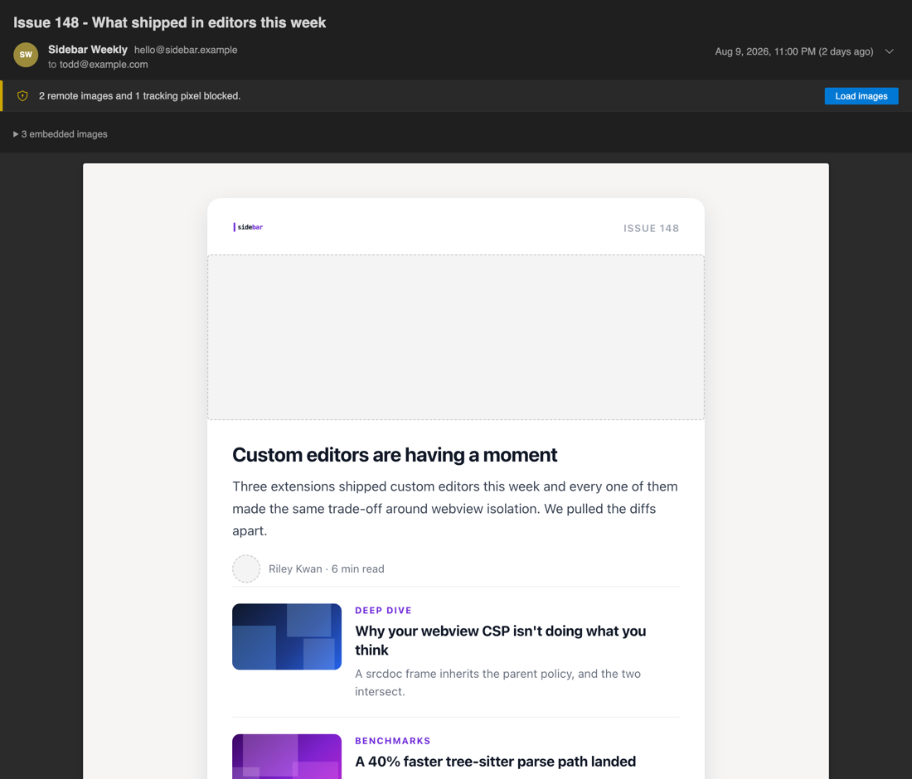
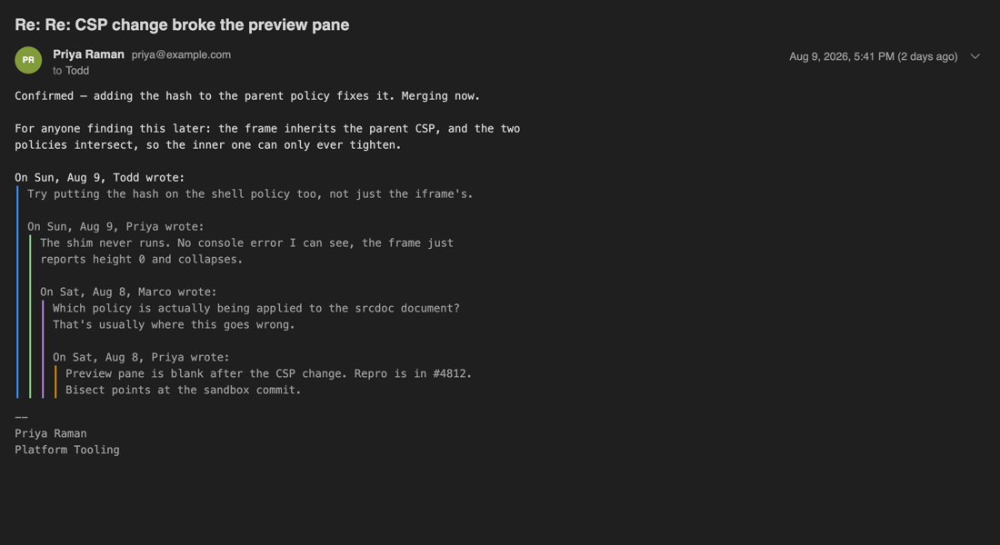

<p align="center">
  
</p>

<h1 align="center">EMLV</h1>

<p align="center"><em><strong>Read all about it!</strong></em></p>

<p align="center">
  <a href="https://marketplace.visualstudio.com/items?itemName=eshojaei.eml-view"></a>
  <a href="https://marketplace.visualstudio.com/items?itemName=eshojaei.eml-view"></a>
  <a href="https://open-vsx.org/extension/eshojaei/eml-view"></a>
  <a href="LICENSE"></a>
</p>

<p align="center">
  Start using <strong>EMLV</strong> today to read <code>.eml</code> email files as rendered email inside VS Code / Cursor. Double-click a <code>.eml</code> in the explorer and you get the message, not MIME source.
  <br /><br />
  <strong>Read-only.</strong> It does not send, reply, or modify anything.
</p>



***

## Contents

* [Features](#features)
* [Install](#install)
* [Development](#development)
* [Settings](#settings)
* [License](#license)

***

## Features

**Remote images and tracking pixels are blocked by Content-Security-Policy**, not by URL rewriting — a pixel cannot fire even if the HTML sanitizer is bypassed. Load them with one click when you want them. Images and declared trackers are counted separately, so the banner tells you what was actually withheld.



**Plain-text mail renders natively in your theme**, in the editor's own monospace font, with colour-coded quote levels and a collapsible reply history.



**Non-UTF-8 mail decodes correctly.** Files are read as bytes, so ISO-8859-1, GB2312 and Shift\_JIS messages render as `Café`, `你好` and `こんにちは` rather than mojibake.

Each rendered `.eml` includes:

* **Header block** includes subject, sender name *and* address, recipient summary, date. Expand for the full From / Reply-To / To / Cc / Bcc detail with copy buttons.
* **HTML body** rendered in a sandboxed frame that sizes itself, on a white page over a tinted canvas so it reads as a document rather than a broken theme.
* **Plain-text body** rendered natively in the editor's own theme and monospace font, with colour-coded quote levels, a collapsible trailing reply history, and `format=flowed` unfolding.
* **Inline images** resolved from `multipart/related` parts.
* **Attachments** listed with type, size and Save As.
* **Remote images blocked** by default, with a one-click opt-in.
* **Reload on change** when the file is rewritten on disk.

## Install

**VS Code**: search *EMLV* in Extensions, or

```sh
code --install-extension eshojaei.eml-view
```

**Cursor / VSCodium / Windsurf**: these install from Open VSX, where the same extension is published

```sh
cursor --install-extension eshojaei.eml-view
```

**From source:**

```sh
npm install && npm run package
cursor --install-extension eml-view-$(node -p "require('./package.json').version").vsix
```

Sideloaded VSIXs do not auto-update, and reinstalling the same version string is a silent no-op in some builds, so bump the patch version when you repackage.

## Development

```sh
npm run watch     # esbuild, both bundles
npm run check     # tsc --noEmit (esbuild strips types without checking them)
npm test          # node --test, no test framework required
```

Press <kbd>F5</kbd> to launch the Extension Development Host. `.vscode/launch.json` passes `--disable-extensions`, which matters: another extension registering a competing `*.eml` custom editor will silently win or produce a "Reopen with…" prompt.

## Settings

| Setting | Default | |
|---|---|---|
| `emlView.images.remotePolicy` | `block` | `allow` loads remote images automatically, telling senders you opened the message |
| `emlView.images.maxInlineTotalMB` | `16` | budget for embedded `cid:` images; beyond it they stay available as attachments |
| `emlView.body.defaultView` | `html` | which part to prefer when a message has both |
| `emlView.body.collapseQuotedText` | `true` | collapse the trailing reply history in plain text |
| `emlView.body.formatFlowed` | `auto` | RFC 3676 unfolding |
| `emlView.reloadOnChange` | `true` | re-render when the file changes on disk |
| `emlView.maxFileSizeMB` | `25` | above this, ask before parsing |

In an untrusted workspace `emlView.images.remotePolicy` is forced to its safe default, so a hostile repository cannot ship a `.vscode/settings.json` that turns every `.eml` in it into a tracking beacon.

## License

MIT
